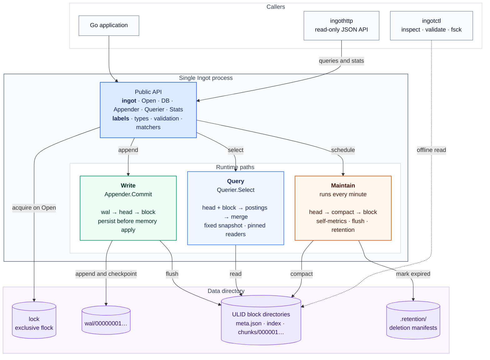

# Ingot architecture

Ingot runs inside one Go process and holds an exclusive advisory lock on its data directory. The diagram shows the main runtime paths; the package map below lists the implementation boundaries.



A [rendered PNG](architecture-final-desktop.png) is available for Markdown viewers that do not support Mermaid.

## Flow notes

1. `Appender.Commit` serializes commits. It writes the batch to the WAL, performs the configured durability step, and only then applies the complete batch to the head. Samples within each series must have strictly increasing timestamps.
2. `DB.Querier` takes a fixed head snapshot and pins every overlapping block reader. Label matchers resolve independently against the head and each block. The result iterator merges samples by timestamp. Blocks take precedence over the head at duplicate timestamps.
3. The maintenance goroutine records Ingot's own metrics, flushes old head chunks, runs one compaction cycle, and applies retention. Compaction copies encoded chunks into a new block. It does not decode and recompress them.
4. A flush writes and syncs chunk and index data, writes and syncs a WAL checkpoint, publishes `meta.json`, validates and activates the checkpoint, installs the block reader, evicts flushed head chunks, and truncates older WAL segments.
5. `meta.json` is the block publication gate. The block reader loads the index into memory and memory-maps chunk segments. Queries hold reader references so compaction cannot remove a source block while it is in use.

## Package map

| Package | Responsibility |
|---|---|
| `ingot` | Public API, lifecycle, block-set coordination, query merge, maintenance scheduling |
| `labels` | Public label types, validation, hashing, and matchers |
| `internal/head` | Mutable write window, series refs, appender commits, WAL replay, flush checkpoints |
| `internal/wal` | Segmented write-ahead log, record framing, CRC validation, syncing, checkpoints |
| `internal/chunkenc` | Gorilla delta-of-delta timestamp and XOR float encoding |
| `internal/block` | Immutable block publication, reading, memory mapping, and integrity validation |
| `internal/index` | Block symbol table, series metadata, chunk references, and label postings |
| `internal/postings` | Sorted posting-list union, intersection, and subtraction |
| `internal/compact` | Compaction planning, encoded chunk merging, and retention selection |

## On-disk layout

```text
<data-dir>/
├── lock
├── wal/
│   ├── 00000001
│   └── 00000002
├── .retention/
│   └── <block-ULID>
└── <block-ULID>/
    ├── meta.json
    ├── index
    └── chunks/
        └── 000001
```
